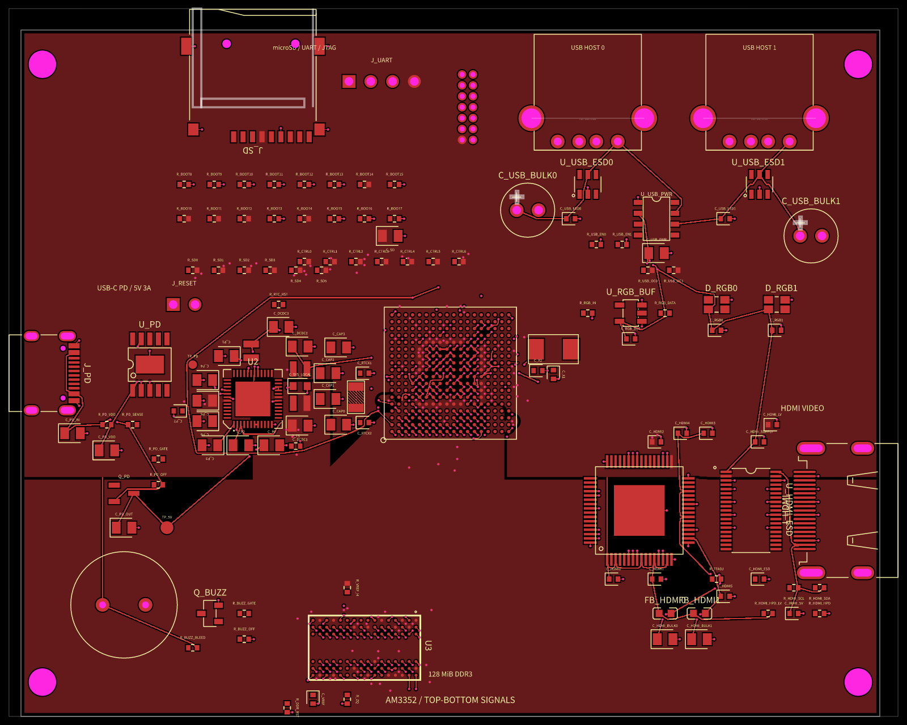
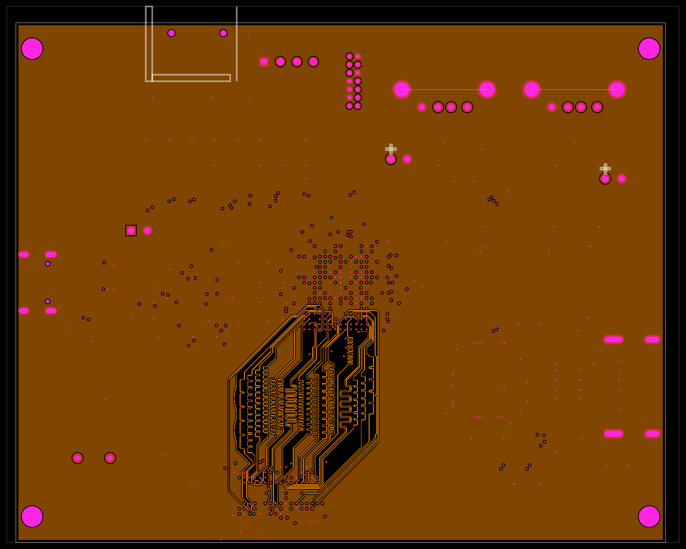
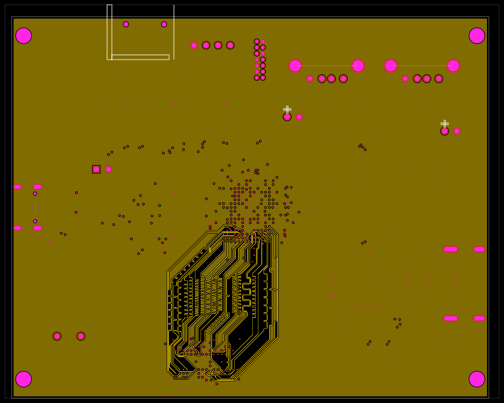
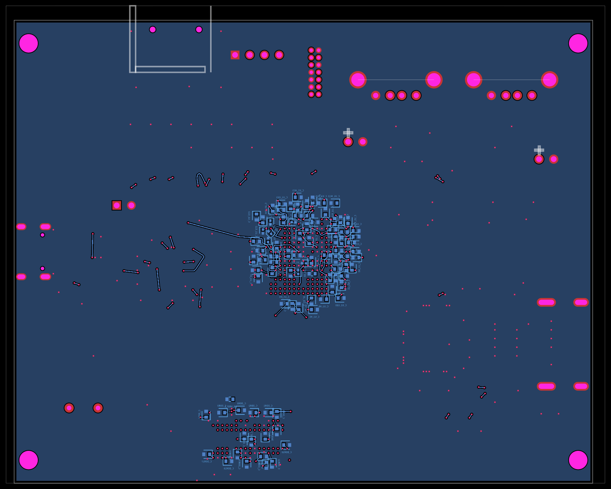

# PCB snapshots

These four snapshot baselines show the inherited partial board checkpoint.
They include the existing 47 DDR paths, which still use inner layers and fail
Top/Bottom routing acceptance. They are visual regression references, not
approved routes or manufacturing signoff.

| Layer | Current checkpoint |
| --- | --- |
| Top |  |
| Inner1 |  |
| Inner2 |  |
| Bottom |  |

Run `bun run test:pcb` to check the baselines, or `bun run snapshot:pcb` to
explicitly regenerate them after inspecting a design change. SVG baselines use
pixel comparison; corresponding PNGs are committed for GitHub visual diffs.
Missing baseline files fail normal test runs. Mismatches write `.diff.png`
files, which CI uploads as the `pcb-snapshot-diffs` artifact.

## DDR regeneration is blocked

Three searches against the actual board failed to produce a complete accepted
47-signal route: the standard native paired-prefix search exhausted its plans
in 44 minutes; an alternative ordering exhausted a 30-minute budget; and a
bounded search window exhausted a 20-minute budget. No route was promoted.
The [search summary](regeneration.json) records their result. Timing, coupling,
physical clearance, fixed copper and self-touching acceptance gates remain in
force.

The exporter now hydrates native fixed copper before compacting the input,
matching live routing and including 79 previously omitted inline via obstacles.
The hydrated fixed-copper baseline has zero physical audit issues.

The `before-*.png` files preserve the inherited checkpoint for a future routing
comparison. `before-ddr.json` records its failing DDR acceptance result.
Once fresh DDR routing passes, update the snapshots and run
`bun run snapshot:pcb-diff` to generate magenta before/after change views.
There is no fresh DDR after-image in this PR yet.
